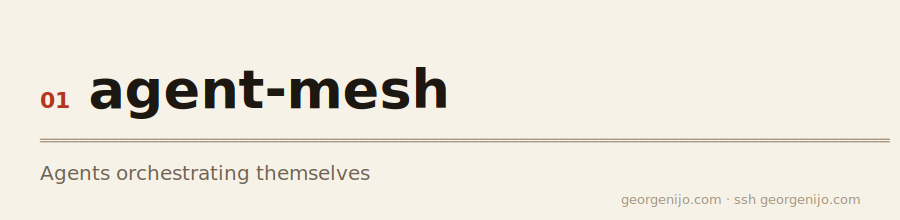
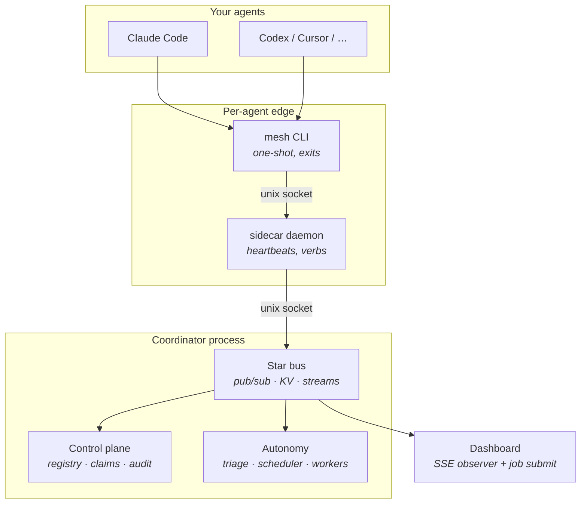
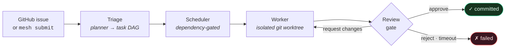

<picture><source media="(prefers-color-scheme: dark)" srcset="docs/banner-dark.svg"></picture>

<div align="center">

# Agent Mesh

**A shared nervous system for coding agents on your machine.**

Local-first coordination so Claude Code, Codex, Cursor, Aider, and friends can discover each other, avoid editing the same files, ask async questions, share a blackboard — and run autonomous job pipelines — through one `mesh` CLI.

<br>

[](go.mod)
[](#)
[](https://github.com/georgenijo/agent-mesh/actions/workflows/ci.yml)
[](#)

<br>

[Quick start](#quick-start) · [Features](#features) · [Architecture](#architecture) · [Autonomous loop](#the-autonomous-loop) · [CLI](#the-mesh-cli) · [Docs](#documentation)

</div>

---

## The problem

You run several coding agents at once. They're blind to each other: two edit the same file, a third re-derives a fact a fourth already figured out, and you babysit all of them.

**Agent Mesh** gives them opt-in coordination — per message, not per turn. Agents work solo by default and touch the mesh only when work overlaps or they're stuck. Then it goes one step further: hand it a ticket and a fleet of agents **builds, reviews, and merges it for you** while you watch.

## Quick start

```sh
git clone https://github.com/georgenijo/agent-mesh.git
cd agent-mesh
make build
export PATH="$PWD/bin:$PATH"

mesh up                              # coordinator + dashboard + observe
mesh join --name me --role builder   # autostarts your sidecar
mesh who                             # see who's live
```

Open the live dashboard at **http://127.0.0.1:8737/ui/** — agents, claims, notes, tickets, jobs, and workers stream in over SSE.

<details>
<summary><strong>Autonomous mode</strong> (planner + workers + optional review)</summary>

```sh
export MESH_REPOS_DIR="$HOME/code"          # maps job.repo → $MESH_REPOS_DIR/<name>
export MESH_PLANNER_CLI=claude              # triage: job → task DAG
export MESH_WORKER_CLI=claude               # scheduler: run tasks in git worktrees
export MESH_REVIEW_ROLE=reviewer            # optional: gate done on expert review

mesh expert serve --name rev --role reviewer   # in another terminal
mesh submit --repo my-app --title "Fix the thing" --body "..."
```

Set `MESH_BUDGET_USD` for a fleet spend cap. See [`internal/config/config.go`](internal/config/config.go) for every knob.

</details>

## Features

| | |
|---|---|
| **Presence** | `join` / `leave` / `who` / `status` with heartbeat leases — live → away → evict |
| **Conflict avoidance** | CAS file claims with TTL; Claude Code claim-guard hook included |
| **Blackboard** | Durable per-repo `note` / `context` streams — replay decisions after restart |
| **Async Q&A** | `ask` returns a ticket immediately; collect via `poll` or inbox hooks — asker never blocks on an LLM turn |
| **Experts** | Resident role-owning responders auto-answer accepted asks (`mesh expert serve`) |
| **Autonomous jobs** | Submit → triage → DAG scheduler → isolated git worktree workers → review gate → merge |
| **Live dashboard** | SSE observer at `/ui/` plus job intake; ops plane via `mesh ops` |
| **Zero deps** | Pure Go stdlib; two static binaries (`mesh`, `meshd`) |

## Architecture



Four planes, one wire contract (`internal/envelope`):

| Plane | Role |
|-------|------|
| **Sidecar** | One per agent. Owns the unix socket, registers, heartbeats, dispatches CLI verbs to the bus. |
| **Star bus** | Coordinator-embedded transport: NATS-*style* subjects (`mesh.>`), KV with CAS/TTL, JSONL-persisted streams. Not a separate NATS process — [`bus.Client`](internal/bus/client.go) is the seam if that ever changes. |
| **Coordinator** | Control plane: registry, claim reclaim, audit fan-out, optional triage/scheduler loops. Role asks are **sidecar pull + CAS accept**, not coordinator-routed. |
| **Dashboard** | Pure observer (SSE `/events`); optional `POST /api/jobs` with a local bearer token. |

### Design principles

1. **Async by default** — an `ask` returns a ticket immediately; the only real cost is the responder's LLM turn (seconds), not transport (microseconds).
2. **CLI at the edge, not MCP** — context-cheap, universal (`bash`), composable. Agents run `mesh`, not injected tool schemas every turn.
3. **One authority per fact** — KV records own state; bus envelopes are observability taps. Typed results everywhere; never fake-success.

## The autonomous loop

Drop a ticket (or point it at a GitHub issue) and the coordinator runs the whole build → review → merge cycle. Every brain is a CLI invocation on **your** subscription — no API key in the core.



- **Persistent experts** stay warm — they hold the codebase map, answer worker questions by role, and **review** every diff. Their context cost amortizes, so reviews are cheap and high-value.
- **Ephemeral workers** spawn per task in a throwaway git worktree, do one job, and exit. The branch is the work product.
- **The gate is real** — a task reaches `done` only on a typed `approve` verdict. `request_changes` re-dispatches with feedback (bounded); reject / timeout fail loudly. Never a silent pass.

> ▶ **See it run:** [a real unattended overnight run](docs/reports/2026-06-28-overnight-run.html) cleared the backlog — **10 issues built, reviewed & merged, ~$26, `main` never broke.**

## The `mesh` CLI

Every command supports `--json`. Exit codes carry meaning:

| Code | Meaning |
|------|---------|
| `0` | ok |
| `3` | no answer yet (`poll`) |
| `4` | no such ticket |
| `5` | not joined |
| `6` | claim lost |
| `7` | dirty runtime (`mesh ops doctor`) |

```sh
# Presence
mesh up | join | leave | who | status

# Conflict + memory
mesh claim <path> | release <path> | announce "…" | note "…" | context

# Async Q&A
mesh ask "…" --role reviewer | poll <ticket> | inbox | answer <ticket> "…"

# Autonomous work
mesh submit | work | expert serve

# Ops
mesh ops doctor | down | clean
```

Full surface: [`ARCHITECTURE.md`](ARCHITECTURE.md) §4.

## Build & test

```sh
make build      # bin/meshd + bin/mesh
make test       # unit + cross-process e2e (~30s)
make e2e        # verbose e2e only
make test-race  # race detector on internal/
make ci         # fmt-check · build · vet · test  (same as GitHub Actions)
```

Cross-process e2e builds real binaries, boots real daemons on temp unix sockets — the done gate.

## Roadmap

Built **cheap-core-first**: presence → claims/blackboard → ask/answer → autonomy → dashboard polish.

| Phase | Scope | Status |
|-------|-------|--------|
| **P0** | Presence, autostart, SSE dashboard | ✅ |
| **P1** | CAS claims, announce, blackboard, hooks | ✅ |
| **P2** | Async ask/answer, ticket FSM, role routing | ✅ |
| **P3** | Experts, triage, scheduler, workers, review, audit | ✅ core spine; cache/rate-limit/dedup deferred |
| **P4** | Production dashboard | 🔶 live `/ui/` observer + job submit; bus visualizer mockup not yet promoted |

**Verified today:** Claude Code headless (`claude -p --output-format json`). Codex/Cursor/Aider adapters stubbed — see [`internal/cliexec`](internal/cliexec).

## Documentation

| Doc | What's in it |
|-----|----------------|
| [**ARCHITECTURE.md**](ARCHITECTURE.md) | Full system design (§1/§11/§12 partly predate the star-bus pivot) |
| [**docs/decisions/DECISIONS.md**](docs/decisions/DECISIONS.md) | Locked decisions — **wins on conflict** |
| [**docs/concepts.md**](docs/concepts.md) | Glossary (NATS terms = conceptual; implementation is the star bus) |
| [**docs/components.md**](docs/components.md) | Per-component feature tiers |
| [**docs/agent-runbook.md**](docs/agent-runbook.md) | Rules for implementation agents |
| [**docs/reports/**](docs/reports/) | Dated build + autonomous-run reports |
| [**docs/mockups/**](docs/mockups/) | HTML prototypes — open in a browser, no build step |

## Project layout

```
cmd/mesh/          thin CLI entrypoint
cmd/meshd/         daemon modes: sidecar · coordinator · dashboard · observe · expert
internal/bus/      star-bus transport (pub/sub, KV, streams)
internal/envelope/ wire contract — every message goes through here
internal/sidecar/  per-agent daemon
internal/coordinator/  control plane + embedded bus server
internal/dashboard/ + web/   SSE observer UI
internal/worker/   git worktree driver (scheduler backend)
test/e2e/          cross-process acceptance tests
hooks/             Claude Code + Codex agent hooks
```

---

<div align="center">

**Local-first · stdlib-only · opt-in coordination**

</div>
